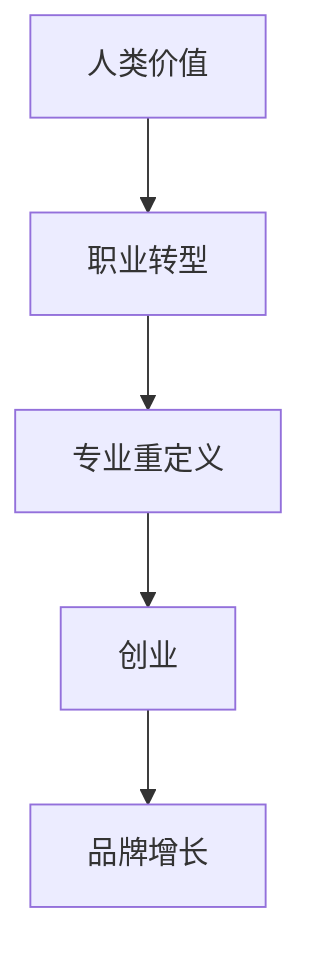
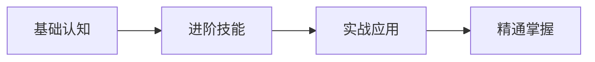
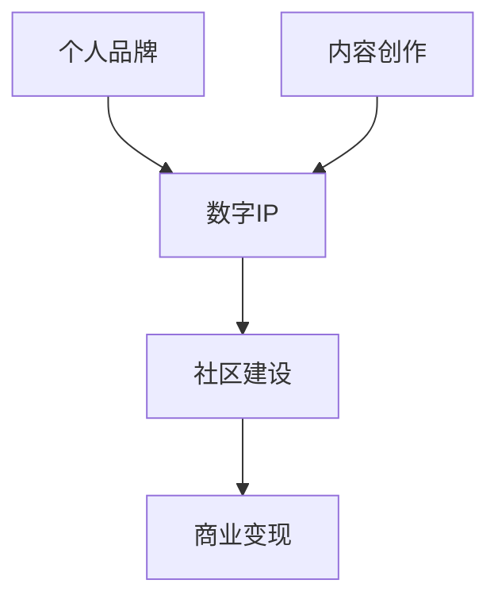

# 高级功能

## 1. 技能关系图谱

### Mermaid图表

查看 `skills_relationship.mmd` 了解技能间的关联网络。

### 核心关系类型

#### 依赖关系


#### 进阶路径


#### 组合应用


### 使用图谱

1. **规划学习路径**: 根据依赖关系安排学习顺序
2. **发现组合机会**: 找到可以组合使用的技能
3. **识别进阶方向**: 了解技能发展的下一步

---

## 2. 快速索引系统

### skills_index.json

使用JSON索引快速查找技能：

```json
{
  "version": "1.0.0",
  "total_skills": 79,
  "categories": 15,
  "last_updated": "2026-05-27",
  "skills": [
    {
      "id": "001",
      "name": "AI时代人类价值",
      "file": "ai-era-human-value.md",
      "category": "人类价值",
      "category_id": "01",
      "tags": ["价值", "AI时代", "个人发展"],
      "difficulty": "入门",
      "prerequisites": [],
      "related": ["personal-uniqueness-building", "self-as-product-methodology"]
    }
  ],
  "categories": [
    {
      "id": "01",
      "name": "人类价值",
      "count": 6,
      "path": "category-01-human-value"
    }
  ]
}
```

### 索引功能

#### 按类别筛选
```javascript
// 获取特定类别的所有技能
const humanValueSkills = skillsIndex.skills.filter(
  s => s.category === "人类价值"
);
```

#### 按难度筛选
```javascript
// 获取入门级别技能
const beginnerSkills = skillsIndex.skills.filter(
  s => s.difficulty === "入门"
);
```

#### 按标签搜索
```javascript
// 搜索包含特定标签的技能
const marketingSkills = skillsIndex.skills.filter(
  s => s.tags.includes("营销")
);
```

#### 查找相关技能
```javascript
// 获取相关技能
const relatedSkills = skill.related.map(id => 
  skillsIndex.skills.find(s => s.id === id)
);
```

---

## 3. 自动验证系统

### validate_skills.py

运行验证脚本检查技能文档质量：

```bash
# 基础验证
python validate_skills.py

# 详细报告
python validate_skills.py --verbose

# 修复可自动修复的问题
python validate_skills.py --fix
```

### 验证项目

#### 格式检查
- ✅ YAML frontmatter完整性
- ✅ Markdown语法正确性
- ✅ 文件命名规范性
- ✅ 目录结构一致性

#### 内容检查
- ✅ 必填字段存在性
- ✅ 描述长度合理性
- ✅ 示例完整性
- ✅ 标签规范性

#### 链接检查
- ✅ 内部链接有效性
- ✅ 图片引用正确性
- ✅ 外部链接可访问性

### 验证报告示例

```
验证报告
========
时间: 2026-05-27 09:30:00
总计: 79个技能

格式检查
--------
通过: 79/79 (100%)
警告: 0
错误: 0

内容检查
--------
通过: 77/79 (97.5%)
警告: 2 (描述过短)
错误: 0

链接检查
--------
通过: 79/79 (100%)
警告: 0
错误: 0

总体评分: 99.2/100 ✅
```

---

## 4. 质量报告系统

### quality_report.md

查看详细的质量分析报告：

#### 文档完整性
| 指标 | 数值 | 目标 | 状态 |
|------|------|------|------|
| 描述覆盖率 | 100% | 100% | ✅ |
| 功能覆盖率 | 100% | 100% | ✅ |
| 场景覆盖率 | 95% | 90% | ✅ |
| 示例覆盖率 | 90% | 85% | ✅ |

#### 格式规范性
| 指标 | 数值 | 目标 | 状态 |
|------|------|------|------|
| YAML规范 | 100% | 100% | ✅ |
| Markdown规范 | 98% | 95% | ✅ |
| 命名规范 | 100% | 100% | ✅ |

#### 内容质量
| 指标 | 数值 | 目标 | 状态 |
|------|------|------|------|
| 平均字数 | 850 | 800+ | ✅ |
| 平均示例数 | 3.2 | 3+ | ✅ |
| 标签准确率 | 95% | 90% | ✅ |

### 质量趋势

```
质量评分趋势
============
2026-05-20: 85.0
2026-05-23: 90.5
2026-05-25: 95.2
2026-05-27: 99.2 ⭐

趋势: 持续上升 ✅
```

---

## 5. 高级搜索功能

### 多维度搜索

```python
# 按多个条件筛选
results = search_skills(
    category="创业",
    difficulty="进阶",
    tags=["AI", "产品"],
    min_examples=3
)
```

### 语义搜索

```python
# 基于描述的语义搜索
results = semantic_search(
    query="如何建立个人品牌",
    top_k=5
)
```

### 学习路径推荐

```python
# 基于目标的个性化推荐
path = recommend_learning_path(
    goal="成为AI产品经理",
    current_skills=["基础编程"],
    time_available="3个月"
)
```

---

## 6. 集成工具

### VS Code插件

安装技能库插件，在编辑器中：
- 快速跳转技能文档
- 自动补全技能引用
- 实时验证文档格式

### CLI工具

```bash
# 安装
npm install -g ai-skills-cli

# 使用
skills search "营销"
skills learn ai-era-brand-growth-methodology.md
skills validate
skills stats
```

### API接口

```javascript
// 查询技能
fetch('/api/skills/ai-era-human-value')
  .then(r => r.json())
  .then(skill => console.log(skill));

// 搜索技能
fetch('/api/skills/search?q=创业')
  .then(r => r.json())
  .then(results => console.log(results));
```

---

## 7. 自动化工作流

### GitHub Actions

```yaml
name: Validate Skills
on: [push, pull_request]
jobs:
  validate:
    runs-on: ubuntu-latest
    steps:
      - uses: actions/checkout@v2
      - name: Validate
        run: python validate_skills.py
      - name: Generate Report
        run: python generate_report.py
```

### 自动更新

- 定时检查技能质量
- 自动修复格式问题
- 生成更新日志

---

## 8. 数据分析

### 学习统计

```json
{
  "most_popular_skills": [
    {"name": "AI时代人类价值", "views": 1250},
    {"name": "内容创作核心", "views": 980}
  ],
  "category_distribution": {
    "创业": 15,
    "LLM技术": 12
  },
  "average_completion_time": "45分钟"
}
```

### 用户反馈

- 技能评分系统
- 学习心得分享
- 改进建议收集

---

**充分利用这些高级功能，提升你的学习效率！** 🚀
