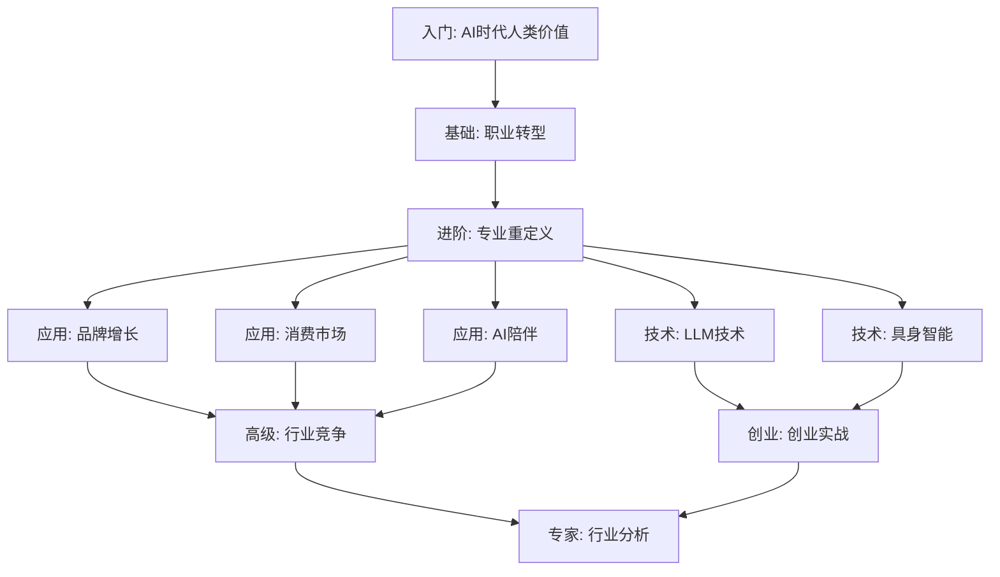
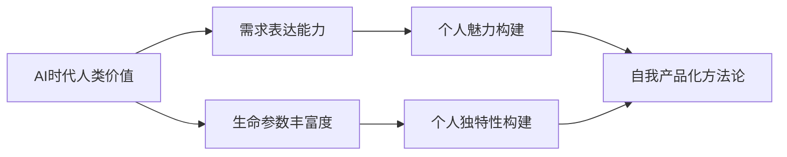
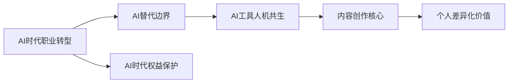
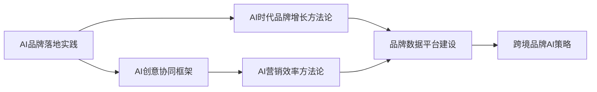
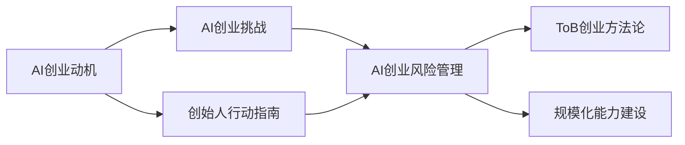
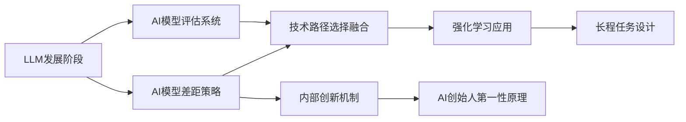

# AI技能库学习路径图

## 总体学习路径

## 按类别学习路径

### 1. 人类价值构建 (category-01-human-value)

**学习建议**: 按顺序学习，先理解AI时代价值转变，再培养具体能力。

### 2. 职业转型 (category-02-career-transition)

**学习建议**: 先评估风险边界，再学习协作方法，最后打造差异化。

### 3. 品牌增长 (category-04-brand-growth)

**学习建议**: 从实践入手，掌握创意和效率工具，再构建数据体系。

### 4. 创业实战 (category-11-startup)

**学习建议**: 先检验动机，再评估风险，最后学习规模化方法。

### 5. LLM技术 (category-10-llm-tech)

**学习建议**: 先了解技术全景，再深入具体技术方向。

## 技能组合推荐

### 组合1: AI时代个人转型
- AI时代人类价值
- AI时代职业转型
- AI替代边界
- AI工具人机共生
- 个人差异化价值

### 组合2: AI赋能内容创作
- 内容创作核心
- AI创意协同框架
- AI赋能IP创作流水线
- 数字IP生态方法论
- 个人独特性构建

### 组合3: AI创业全流程
- AI创业动机
- AI创业风险管理
- 创始人行动指南
- 规模化能力建设
- AI产品落地策略

### 组合4: 技术驱动创新
- LLM发展阶段
- AI模型评估系统
- 强化学习应用
- 内部创新机制
- 技术商业化时机

## 难度分级

| 难度 | 技能 |
|------|------|
| ⭐ 入门 | AI时代人类价值、AI时代职业转型、LLM发展阶段、AI创业动机 |
| ⭐⭐ 初级 | 需求表达能力、AI替代边界、AI工具人机共生、内容创作核心 |
| ⭐⭐⭐ 中级 | 个人魅力构建、AI创意协同框架、AI产品落地策略、AI创业风险管理 |
| ⭐⭐⭐⭐ 高级 | 品牌数据平台建设、全栈竞争框架、技术商业化时机、强化学习应用 |
| ⭐⭐⭐⭐⭐ 专家 | AI投资分析、泡沫判断框架、规模化能力建设、长程任务设计 |

## 学习时长建议

| 路径 | 技能数 | 建议时长 |
|------|--------|----------|
| 快速入门 | 4个 | 1周 |
| 系统学习 | 15个 | 1个月 |
| 深度掌握 | 30个 | 3个月 |
| 全面精通 | 79个 | 6个月 |

## 实践建议

1. **每学一个技能，完成一个实践项目**
2. **建立学习笔记，记录关键洞察**
3. **寻找学习伙伴，互相讨论验证**
4. **定期回顾，更新认知**
5. **输出分享，教是最好的学**
